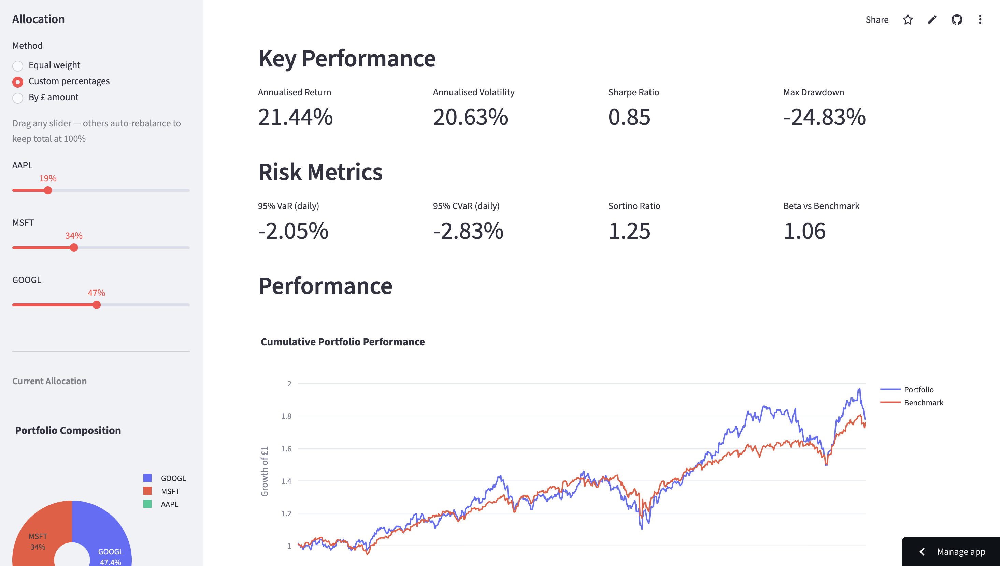
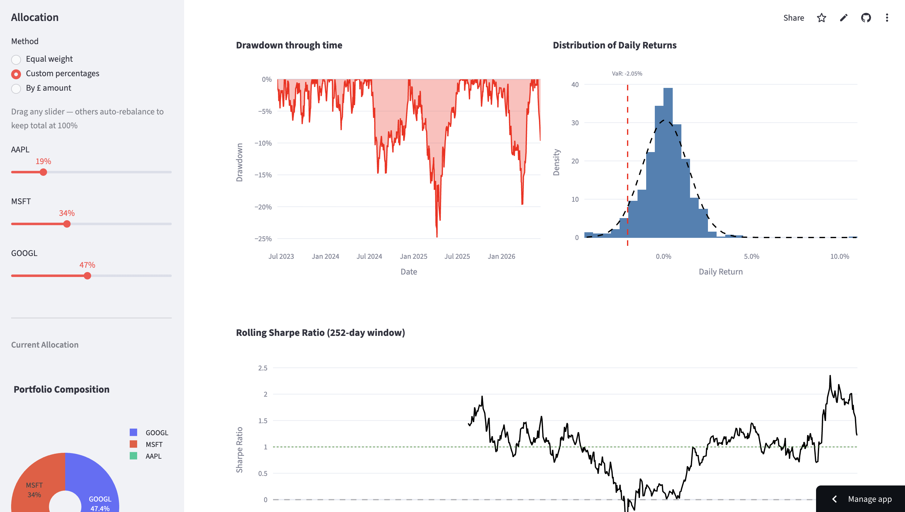
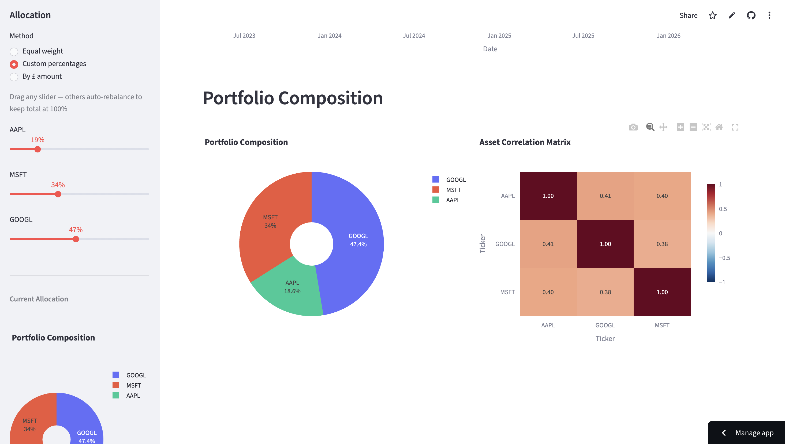
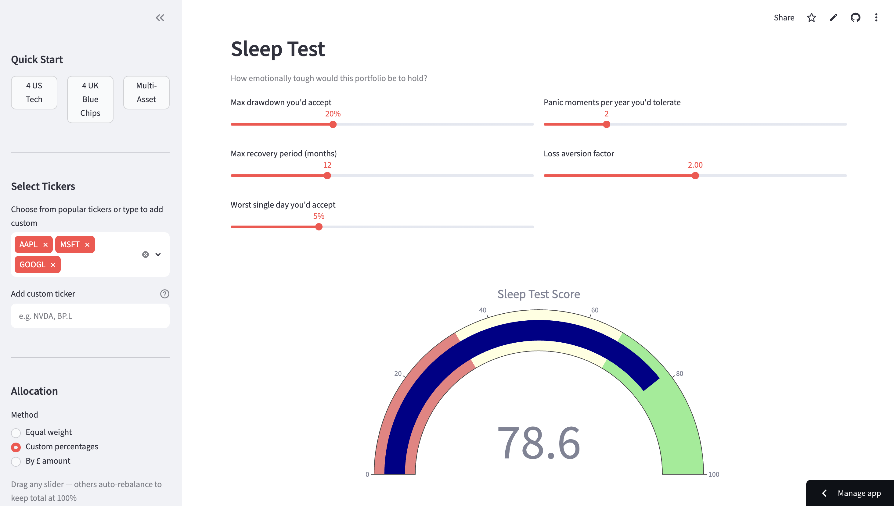
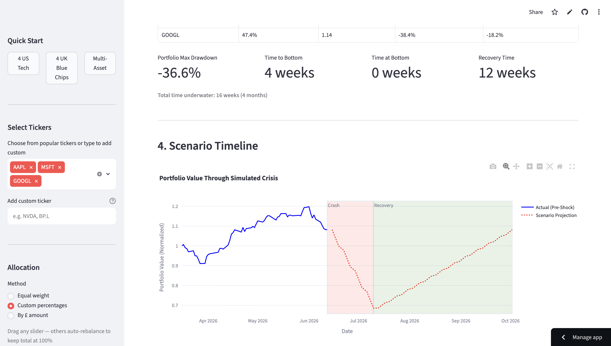

# Portfolio Risk Dashboard

An interactive Streamlit dashboard for analysing portfolio risk and performance. Includes stress testing with factor shocks, behavioural "sleep test" scoring, and scenario simulations with drawdown anatomy.



## Live Demo

**[Try the dashboard here](https://risk-dashboard-padraig.streamlit.app)** — no installation required.

## About this project

I'm a first-year economics and finance student interested in quantitative risk management. After building a Markowitz portfolio optimiser, I wanted to explore the other side: once you've built a portfolio, how do you measure and stress-test its risk?

This dashboard lets you:
- Analyse historical risk metrics (VaR, CVaR, Sharpe, drawdowns)
- Test whether a portfolio matches your personal risk tolerance
- Simulate how your portfolio would behave in a market crisis

The goal was to make something interactive rather than static — employers can actually use it, not just read about it.

## Features

### Tab 1: Risk Dashboard

Core performance and risk metrics for any portfolio.

| Metric | What it measures |
|--------|------------------|
| Annualised Return | Compound annual growth rate |
| Annualised Volatility | Standard deviation of returns × √252 |
| Sharpe Ratio | Risk-adjusted return (excess return / volatility) |
| Max Drawdown | Worst peak-to-trough decline |
| 95% VaR | Worst expected daily loss at 95% confidence |
| 95% CVaR | Average loss when VaR is breached |
| Sortino Ratio | Sharpe but only penalises downside volatility |
| Beta | Sensitivity to benchmark movements |

**Visualisations:**



- Cumulative returns vs benchmark
- Drawdown chart over time
- Return distribution with VaR lines
- Rolling 1-year Sharpe ratio



- Correlation heatmap
- Portfolio weights pie chart

### Tab 2: Sleep Test

Behavioural risk scoring — measures how emotionally comfortable you'd be holding the portfolio.



**Inputs (5 sliders):**
- Max drawdown you'd accept
- Max recovery period (months)
- Worst single-day loss you'd accept
- Panic moments per year (days with >3% loss)
- Loss aversion factor (how much losses hurt vs gains)

**Scoring:**
```
score = (your_tolerance / actual_portfolio_value) × 100
```

Each dimension scores 0–100. Composite score = simple average of all five.

**Output:**
- Gauge chart (red/yellow/green zones)
- Radar chart comparing your portfolio to the ideal

### Tab 3: Stress Test Scenarios

Simulates how your portfolio would behave through a market crisis using **factor shocks** and **drawdown anatomy**.



**Factor Shocks:**

Instead of arbitrarily saying "what if AAPL drops 40%", this approach shocks underlying market factors:

| Factor | What it represents |
|--------|-------------------|
| Market Shock | Broad equity decline (%) — applied via beta |
| Rate Shock | Interest rate increase (bps) — higher vol assets more sensitive |
| VIX Spike | Volatility level — additional negative impact |

Each asset's shock is calculated from its factor exposures:
```
asset_shock = (beta × market_shock) + (rate_sensitivity × rate_shock) + vix_impact
portfolio_shock = Σ(asset_shock × weight)
```

**Crisis Shapes:**

| Shape | Crash | Bottom | Recovery | Example |
|-------|-------|--------|----------|---------|
| V-Shape | 4 wks | 0 wks | 12 wks | COVID March 2020 |
| U-Shape | 8 wks | 16 wks | 24 wks | 2008 Financial Crisis |
| L-Shape | 8 wks | 52 wks | 0 wks | Japan 1990s |

**Output:**
- Table of each asset's beta, shock, and contribution
- Key stats (max drawdown, time underwater)
- Timeline chart showing actual data → crash → bottom → recovery

## Sidebar Controls

- **Ticker selection** — choose from presets or add custom (Yahoo Finance format)
- **Weight allocation** — equal weight, custom percentages, or by £ amount
- **Time period** — 6 months to 10 years lookback
- **Benchmark** — SPY, QQQ, ISF.L, etc.
- **Risk-free rate** — for Sharpe/Sortino calculations

## Limitations

- **Historical data** — past performance doesn't predict the future
- **Rate sensitivity** — uses volatility as a proxy, not actual duration
- **Recovery simulation** — assumes linear path back to original value
- **Correlations** — doesn't model correlation spikes during crises
- **No transaction costs** — assumes frictionless trading

## Run it locally

```bash
git clone https://github.com/poggey/risk-dashboard.git
cd risk-dashboard
python3 -m venv .venv
source .venv/bin/activate
pip install -r requirements.txt
streamlit run app.py
```

## Project Structure

```
risk-dashboard/
├── app.py                 # Main Streamlit application
├── src/
│   ├── data.py           # Price fetching and returns calculation
│   ├── metrics.py        # Risk and performance metrics
│   └── visualisations.py # Plotly chart functions
├── requirements.txt
└── README.md
```

## Stack

Python 3.13 · Streamlit · Pandas · NumPy · Plotly · yfinance

## What I learned

- Building interactive dashboards with Streamlit and session state
- Calculating risk metrics (VaR, CVaR, Sharpe, beta, drawdowns)
- Factor-based stress testing vs single-asset shocks
- Separating concerns (data / metrics / visualisation / app)
